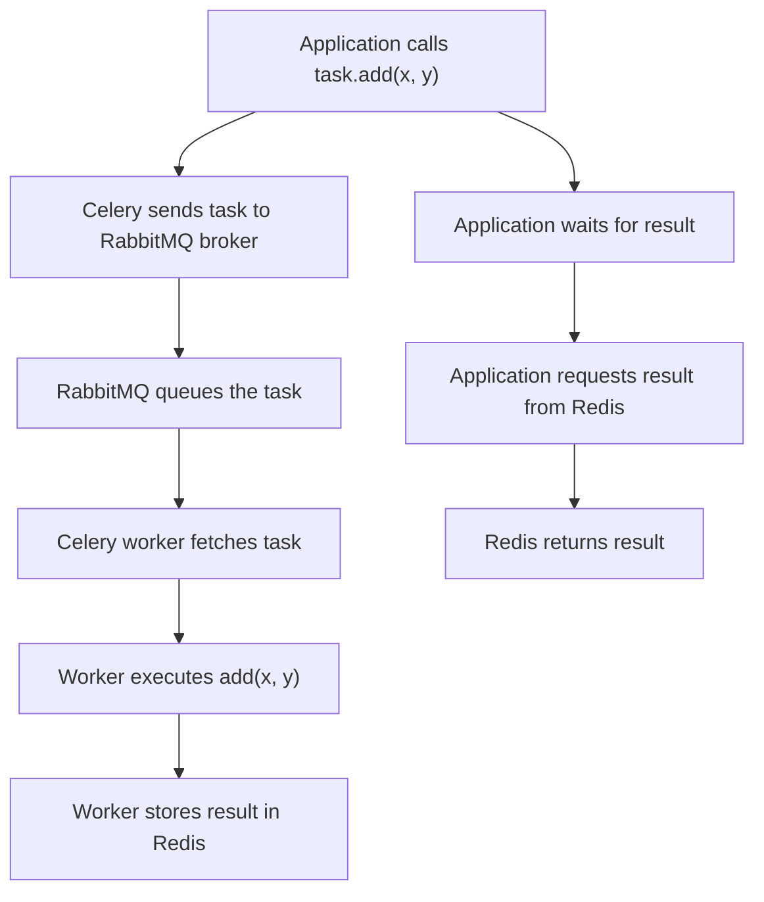

# Celery example

Very basic example demonstrating the usage of [celery](https://docs.celeryq.dev/) for a task queue.

All the tasks can be found in the shared module [tasks.py](./src/celery_example/tasks.py). These are then called by the [package](./src/celery_example/__main__.py).



## Docker testing

For testing, you can either use docker:

1. Copy the env file:

    ```shell
    cp .env.example .env
    ```

2. Run services

   ```shell
   docker compose up
   ```

## Pytest testing

For testing in pytest, we add an [autouse fixture](./tests/conftest.py#L6) which converts the app into eager evaluation and thus does not backends.
